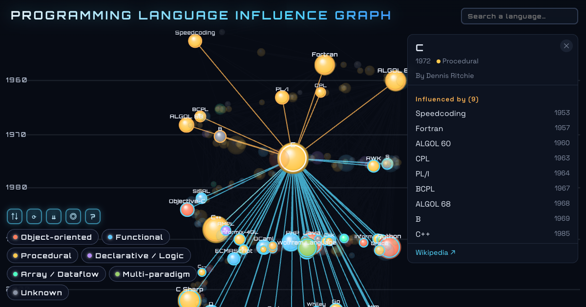

# Programming Language Influence Graph

An interactive 3D visualization of how programming languages influenced one another,
built from Wikipedia's *influenced / influenced by* data. Languages spiral up a **time helix**
(height = year of appearance), colored by paradigm and sized by number of connections.
Click a language to trace its lineage (influencers in amber, descendants in cyan). Left idle,
the view slowly drifts down the timeline and loops. Selections are shareable — picking a
language puts a `#lang=` link in the URL bar.

**Live:** <https://taka-hira.dev/pl-graph/>

## About

- 349 languages, 1,056 influence edges (English Wikipedia).
- Dependency-free and fully self-contained: vanilla JavaScript + Canvas 2D. No build step,
  no libraries, no external requests — fonts are bundled, so it also works offline.
- The helix layout is computed once at load from each node's year; the per-frame loop only
  projects and draws.
- Run locally: clone and open `index.html` — no server, no build required.

## Controls

- Drag / one finger — rotate & tilt
- Two-finger scroll — pan
- Mouse wheel / pinch — zoom
- Click a node — select, trace lineage, open detail card (Esc or click empty space to
  deselect and restore the previous view)
- Dock (above the legend) — flip time axis · auto-rotate · time drift · center-on-click · help (?)
- Search (top right) — jump to a language (arrow keys + Enter work too)
- Legend chips — filter by paradigm

## Data notes

- Built from the *influenced / influenced by* fields of language infoboxes on English
  Wikipedia (snapshot fetched 2026-07-16).
- `data.js` is a prebuilt artifact — the extraction pipeline is not included in this repository.
- Languages whose Wikipedia article has no language infobox (e.g. Bash) are not included.
- Influence edges are Wikipedia's self-reported data, rendered as-is (a few edges point
  backwards in time).
- Paradigm classification is a keyword heuristic; languages with an unknown year are placed
  at the dataset's median year.

## Credits

- The presentation approach — a dependency-free, rotating Canvas 2D graph — was **inspired by
  Marble's learning-topic graph** ([withmarbleapp/os-taxonomy](https://github.com/withmarbleapp/os-taxonomy) /
  <https://withmarble.com/curriculum>), which renders an offline-precomputed force layout.
  This project is an **independent, clean-room implementation**: a different spatial form
  (a time helix computed at load), with its own projection, rendering, hit-testing, and
  interaction code. Marble's data is **not** used.
- Language data derived from **Wikipedia** (CC BY-SA 4.0).
- Fonts **Orbitron** and **Space Grotesk** (SIL Open Font License — full license texts in
  [fonts/](fonts/)), bundled as woff2.
- Code licensed under the **MIT License** (see [LICENSE](LICENSE)).
